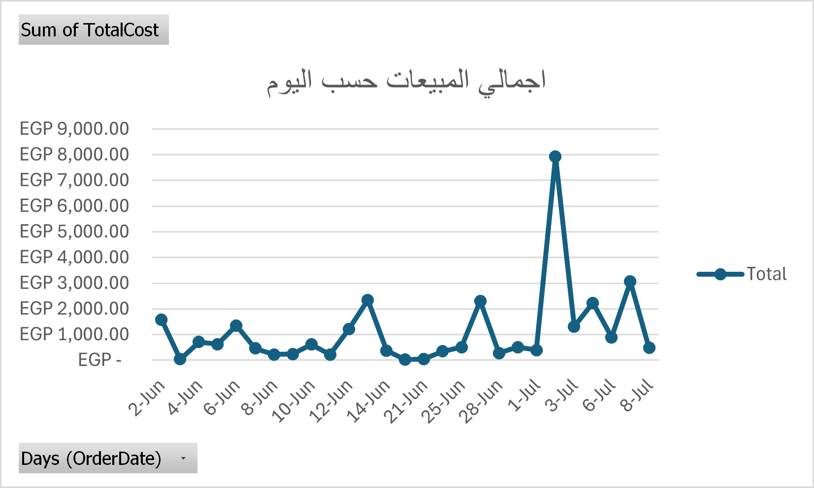
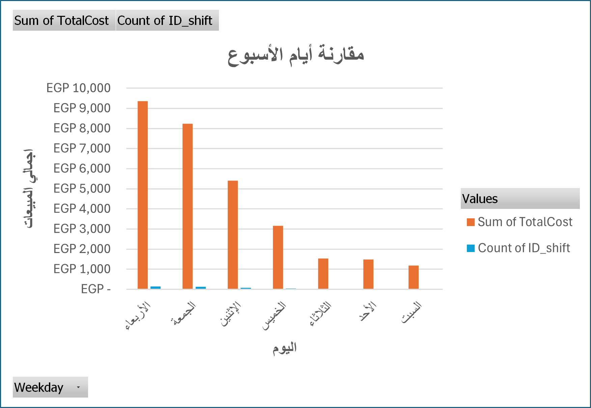
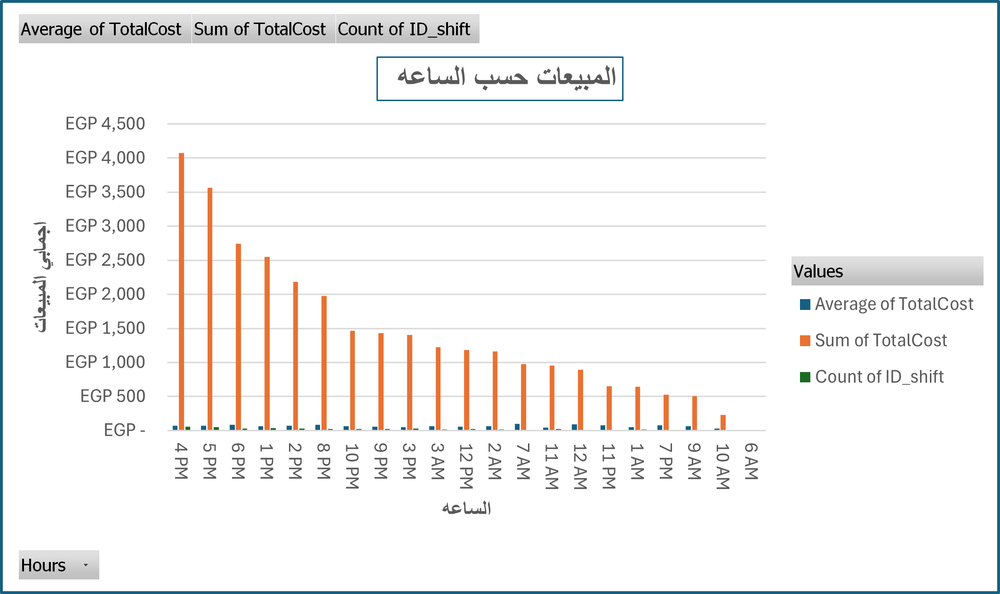

# 📊 Ketchup Restaurant Sales Analysis

## 📌 Project Overview
This project is a **real-world case study** based on actual cashier data from **Ketchup Restaurant** (June 2 – July 8, 2025).  
The goal is to analyze sales performance, identify peak and low-demand periods, and provide actionable recommendations to improve operations and revenue.  

---

## 📂 Project Files
- **Raw Data.xlsx** → Exported cashier data (untouched raw dataset).  
- **Analysis Sheet.xlsx** → Cleaned dataset with pivot tables, charts, and calculations.  
- **Presentation.pptx** → Business presentation summarizing key findings.  
- **images** → Screen and graphs of insights.

---

## ⚙️ Tools Used
- **Microsoft Excel** → Data cleaning, analysis, and visualization.  

---

## 📈 Key Performance Indicators (KPIs)

### 🛒 Average Daily Sales  
**~1,010 EGP**  
> Average daily revenue during the analysis period.  

### 📆 Best Performing Day  
**Wednesday (Highest Revenue)**  
> Wednesday consistently generated the highest sales, followed by Friday.  

### 📉 Lowest Performing Days  
**Saturday, Sunday, Tuesday**  
> Weak sales performance, recommended for targeted promotions.  

### ⏰ Peak Sales Periods  
**1 PM – 6 PM** and **8 PM – 10 PM**  
> Core business hours with the highest sales volume.  

### 💤 Lowest Demand Periods  
**9 AM – 11 AM** and **1 AM**  
> Very low activity; opportunities for “Happy Hour” style promotions.  

### 💳 Average Order Value  
**Evening orders > Lunch orders**  
> Even with similar order counts, evening transactions have higher bill sizes per customer.  

---

## 📸 Sample Insights

### Sales by Total of Day

### Sales by Day of Week

### Hourly Sales Trend

---

## 🔍 Analysis & Insights
- **Morning sales are weak** → only 107 invoices (lowest volume).  
- **Evening has highest average bill value**, even though order counts are similar to lunch.  
- **Wednesday leads in total sales**, while **Tuesday, Saturday, and Sunday lag behind**.  
- Only **5 days exceeded 2000 EGP**, while **18 days dropped below 1000 EGP**.  
- **July 2nd** was the strongest day with **7,932 EGP in sales**.  

---

## 💡 Recommendations
- **Target low-demand periods** (morning & off-peak hours) with discounts, combos, or special offers.  
- **Run weekday promotions** (especially Tuesday, Saturday, Sunday) to balance weekly performance.  
- **Adjust staffing schedules** to match demand patterns → more staff during peaks, fewer during quiet hours.  
- **Focus evening promotions** on upselling higher-value meals, since bill size is naturally higher.  
- **Expand delivery/online offers** during low footfall hours to boost sales.  

---

## 🚀 Future Improvements
- Automate analysis using **Power BI** or **Tableau** dashboards.  
- Apply **Python & Pandas** for deeper statistical insights and forecasting.  
- Incorporate **customer segmentation** if detailed data becomes available.  

---

👤 **Author**: [Gaser Ashraf Nofal]  
📅 **Year**: 2025  
